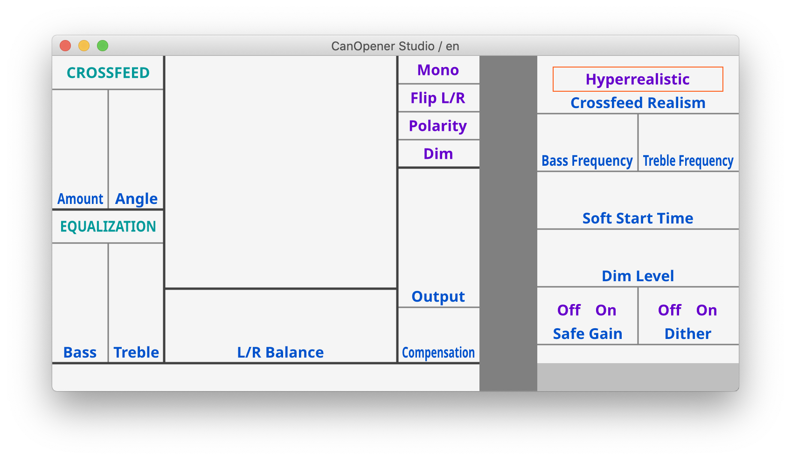

All files in `translatable` are translatable.

The value `1` is a special value that means the English string should be displayed even when the interface is translated into another language; i.e. `.ja(1)` means the Japanese version of the interface will display whatever the English text is.

The value `0` is a special value that means the string has not been translated. This means, in a code editor, if you open up this entire repository and run a find-all, if you search for the string `.ja(0)`, that will quickly show you all the strings that need to be translated into Japanese.

### Previewing translations in the interface



`pbtranslations` includes a Python program that can display a text-only, interactive version of the plugin interfaces that pulls translations directly from the code (so if you launch the viewer and then save a change in a translation file, that change will automatically appear in the viewer).

To run the viewer, you'll need a working python virtual env with this repository installed. And to get a working python virtual env set up, you'll need a recent version of python, >= 3.8 (available from https://www.python.org/downloads/).

Once you have a python3.8 or python3.9 installed, you can clone this git repo to your local computer and install the virtualenv like so: 

```
git clone https://github.com/goodhertz/pbtranslations.git
cd pbtranslations
python3.9 -m venv venv --prompt=pbt
source venv/bin/activate
pip install -e .
```

(N.B. `python3.9` there can also be `python3.8`, depending on your installation.)

Once you've completed those steps, you'll also need to download the full (~1GB) family of open-source Noto fonts from Google, available here: https://www.google.com/get/noto/ — once you have that downloaded, unzip the archive, then drag the `Noto-unhinted` folder into this repository on your computer. If it's installed correctly, when you run `ls` in this repo, you see something like this appear (that is, Noto-unhinted appears at the top-level of the repo):

```
LOOKUP.md
Noto-unhinted
README.md
check.py
layouts
pbt
pbt.egg-info
setup.py
translatables
venv
view.py
```

Once you've made sure you have the Noto fonts in that location, you can run the view.py command, like so:

```
coldtype view.py 1
```

After a moment, a window should appear showing the English version of CanOpener (aka catalog #0001). To cycle through available languages, use the left or right arrow key. To cycle through plugins, use the `U` or `Y` keys to go back and forth respectively.

The catalogs are listed with their corresponding plugin names and translation file paths in the LOOKUP.md file in this repo, and the language abbreviations are listed here (and will appear in the top-bar of the viewer when a given language is selected).

```
en English
es Spanish
pt Portuguese
fr French
ja Japanese
ko Korean
zh-Hans Chinese (Simplified)
zh-Hant Chinese (Traditional)
ar Arabic
he Hebrew
```

#### Colors

- __Green__ == a clump label
- __Blue__ == a parameter label
- __Purple__ == a control value
- __Pink__ == a string that cannot/should not be translated (untranslatable)
- __Orange__ == a multi-value control (see below)

#### Multi-value controls

Because some translatable strings are not shown in the interfaces in their default state, if you click on a string in an orange box in the viewer, that will cycle through the available values for that multi-value control. (If there is no orange box, all the translatable strings are visible in the viewer.)

#### Note on aesthetics

If you think to yourself when you open the viewer `dang this is ugly`, your assessment is correct. The viewer is meant to display translated strings in their correct location in the interface, not to closely mimic how the eventual plugin will actually look in terms of typography, i.e. font choice. (We can't distribute the actual fonts we use in the plugins, so the Noto open-source family is the next best thing.)